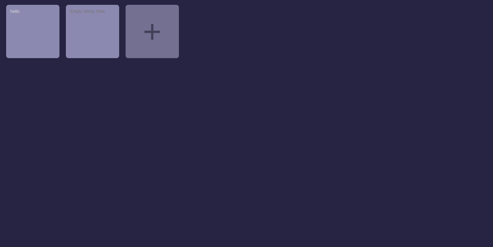

  <h1>Sticky Notes</h1>  
  
A simple sticky notes website.

  
  
  
You can check the page, and see it working <a href="https://yasminconstantino.github.io/Sticky-notes/">here</a>

  <h4> Languages and Technologies:</h4>
  

    
    
    
  

 
<h5>...</h5>
 
<section>
  

    
Clique aqui para ler em português

    
Este é um simples site de notas autoadesivas.

    
Você pode acessar a página e ver ela funcionando <a href="https://yasminconstantino.github.io/Sticky-notes/">aqui</a>

    <h4>Linguagens e tecnologias utilizadas:</h4>
  

    
    
    
  

  

</section>

